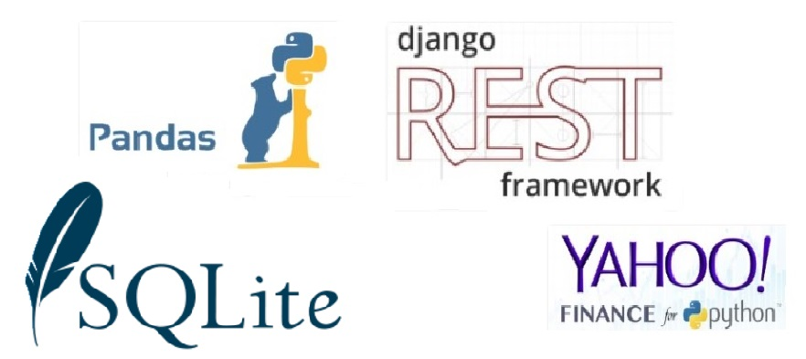
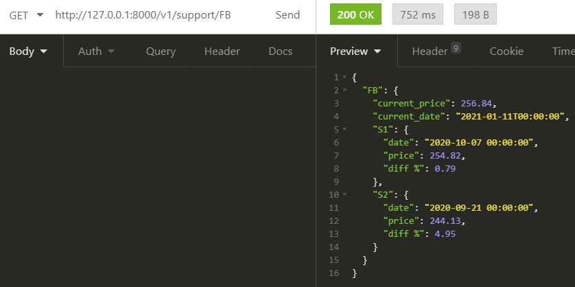
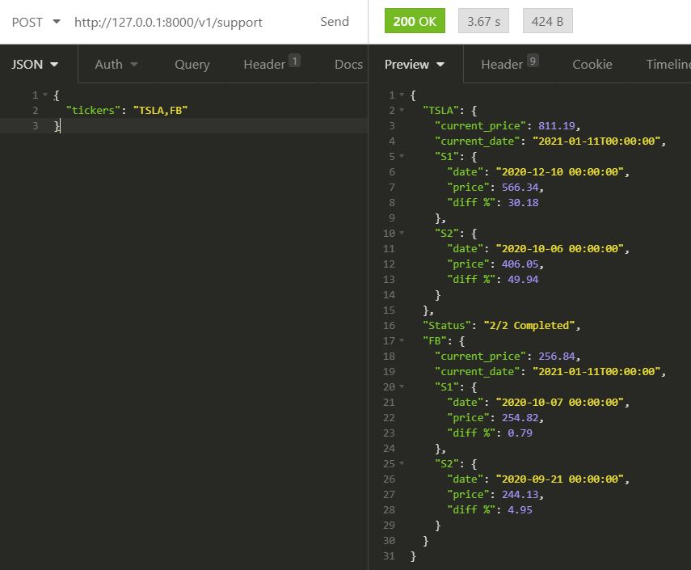
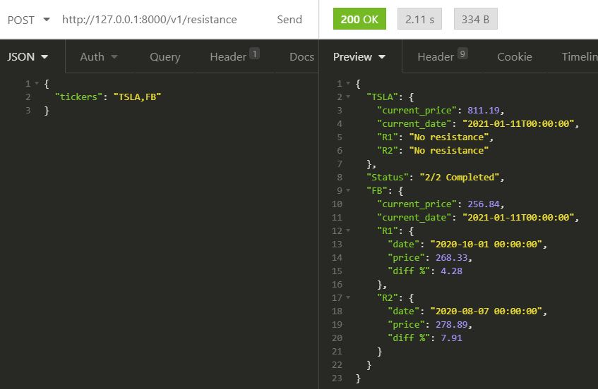
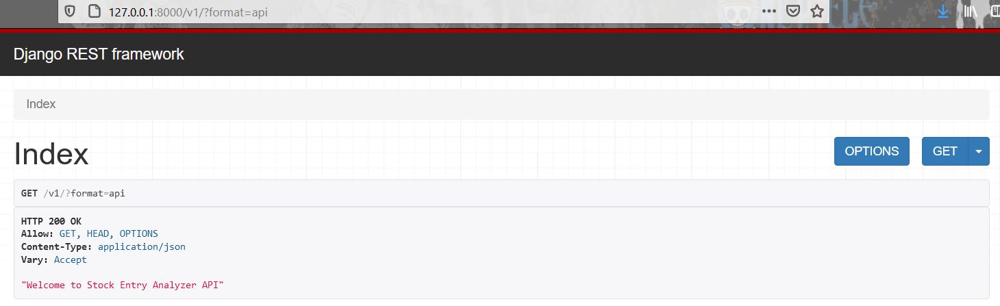

# stock-entry-analyzer
<p>stock-entry-analyzer, Is a Stock Market web API that aims to automate analysis of the stock market price resistance and support based on available historical data. </p>

## Technology Stack


## Development
### Virtual environment
<p> Setup python environment </p>

1. Create a python virtual environment

    `$ python3 -m venv env`
2. Activate virtual environment 

    `$ <project-dir>\env\Scripts\activate`
    
3. Install the python modules listed in `requirements.txt`
  * Python Libraries
    * django==3.1.2
    * yfinance==0.1.15
    * pandas==1.1.3
    * pandas-datareader==0.9.0
    * djangorestframework==3.12.2

    `$ pip install -r requirements.txt`

### Database Setup
see project's `settings.py`
```
DATABASES = {
    'default': {
        'ENGINE': 'django.db.backends.sqlite3',
        'NAME': BASE_DIR / 'db.sqlite3',
    }
}
```


## API Endpoints
https://`<host>`:`<port>`/v1/<API Endpoints>

### Stock Market Tickers
#### GET /support/<str:ticker> 200


#### GET /resistance/<str:ticker> 200


#### POST /support 201


#### POST /resistance 200


## Execution
1. Run django app using command:

    `python manage.py runserver`


